---
## Author
author:
  name: Репкина Елизавета Андреевна
  email: 1132246753@rudn.ru
  affiliation:
    - name: Российский университет дружбы народов
      country: Российская Федерация
      postal-code: 117198
      city: Москва
      address: ул. Миклухо-Маклая, д. 6

## Title
title: "Внешний курс. Раздел 1."
---

# Информация

## Докладчик

:::::::::::::: {.columns align=center}
::: {.column width="70%"}

  * Репкина Елизавета Андреевна
  * НКАбд-04-24
  
:::
::: {.column width="30%"}

:::
::::::::::::::

# Вводная часть

## Цели и задачи

Прохождение внешнего курса "Основы кибербезопасности". Получение знаний в сфере кибербезопасности.

# Выполнение лабораторной работы
## 1
 HTTPS-протокол прикладного уровня, IP-сетевого, UPD и ТСР-транспортного. ([рис. @fig-001])

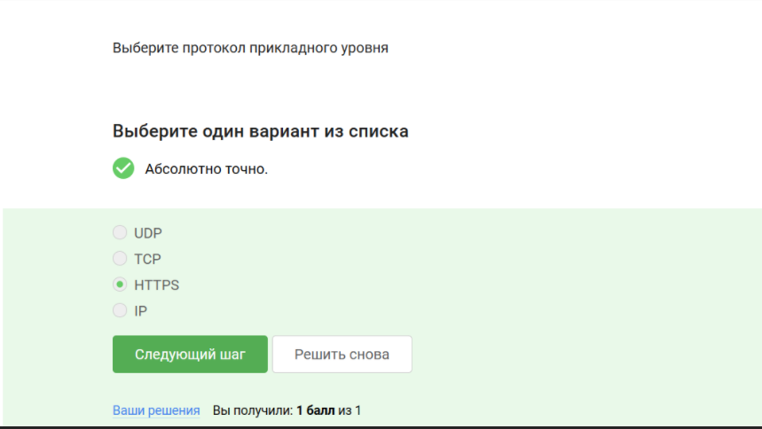{#fig-001 width=70%}

## 2 

ТСР- протокол транспортного уровня ([рис. @fig-002])

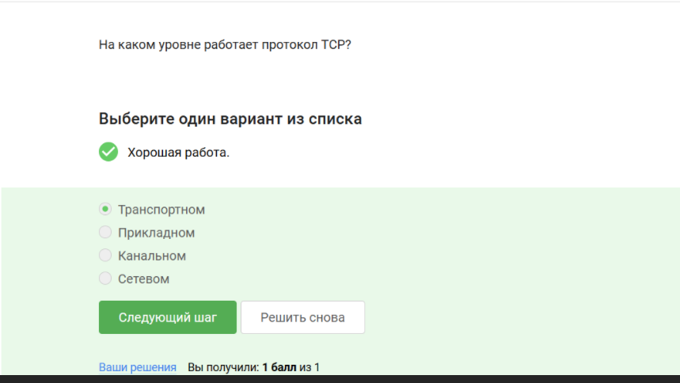{#fig-002 width=70%}

## 3

Не должно превышать 255 ([рис. @fig-003])

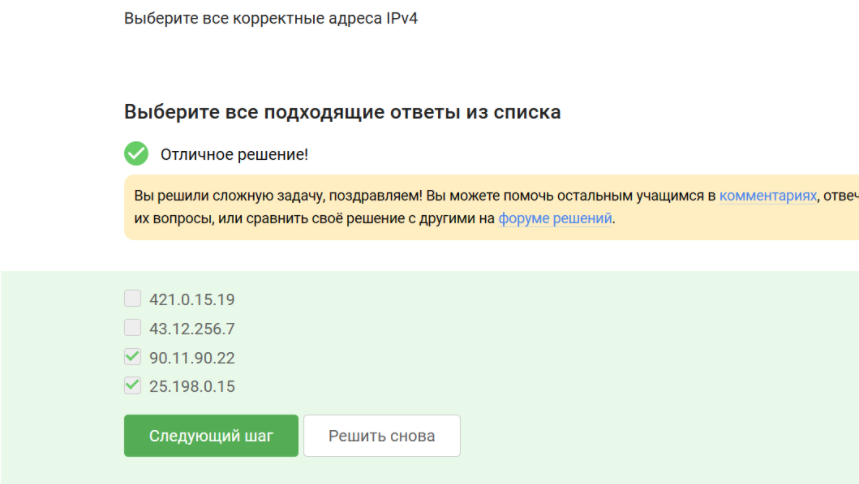{#fig-003 width=70%}

## 4

DNS используется для преобразования удобно читаемых доменных имен ([рис. @fig-004])

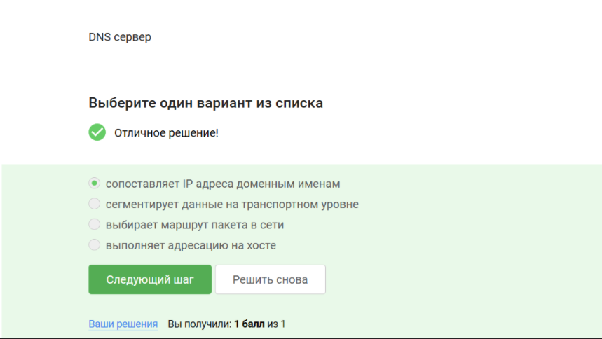{#fig-004 width=70%}

## 5

Правильная последовательность протоколов указана на ([рис. @fig-005])

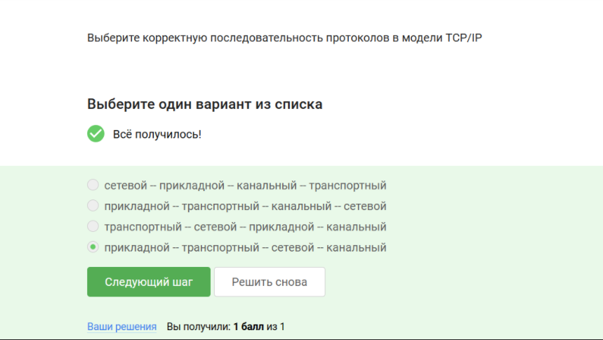{#fig-005 width=70%}

## 6

HTTP предполагает передачу данных в открытом виде([рис. @fig-006])

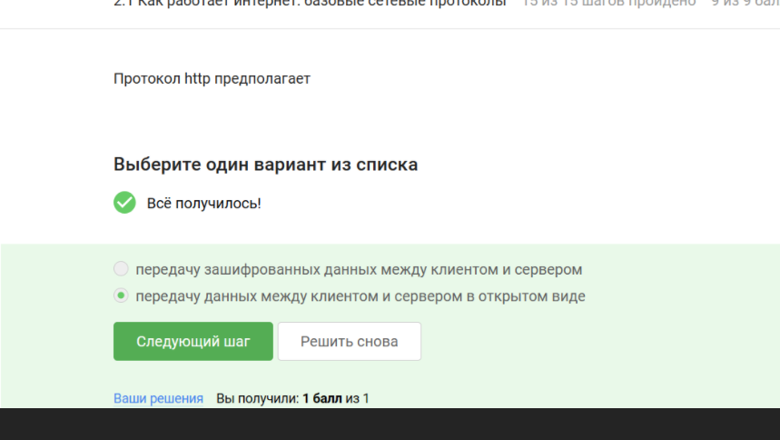{#fig-006 width=70%}

## 7

HTTPS состоит из рукопожатия и передачи данных ([рис. @fig-007])

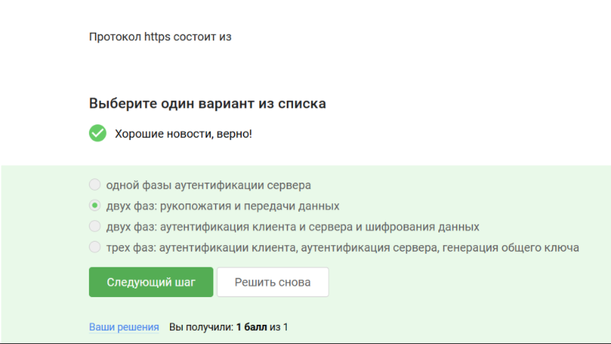{#fig-007 width=70%}

## 8

Версия протокола выбирается в процессе переговоров ([рис. @fig-008])

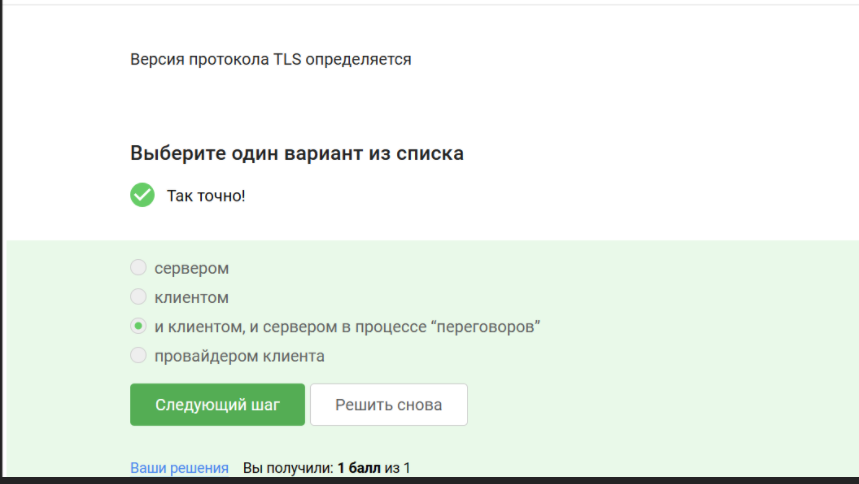{#fig-008 width=70%}

## 9

Шифрование предусмотрено после фазы рукопожатия ([рис. @fig-009])

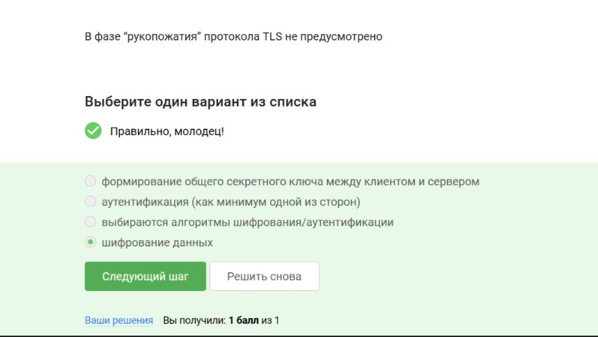{#fig-009 width=70%}

## 10

Куки не хранят пароли и IP адреса ([рис. @fig-010])

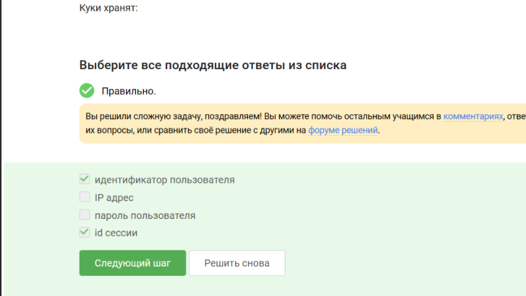{#fig-010 width=70%}

## 11

Куки не влияет на улучшение надежности соединения ([рис. @fig-011])

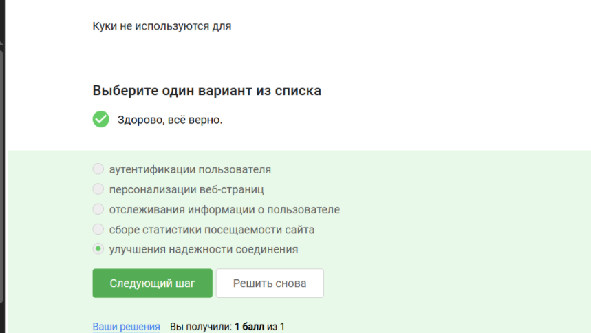{#fig-011 width=70%}

## 12

Клиент не генерирует куки ([рис. @fig-012])

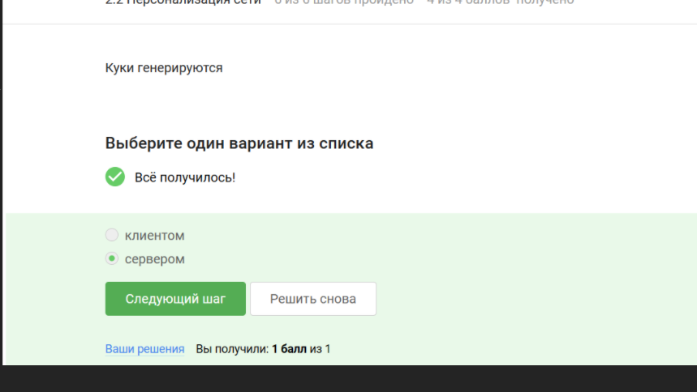{#fig-012 width=70%}

## 13
Сессионные куки хранятся в браузере только на время пользования веб сайтом ([рис. @fig-013])

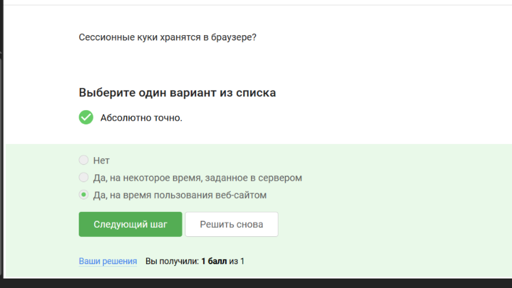{#fig-013 width=70%}

## 14

TOR-луковая сеть, содержащая 3 промежуточных узла ([рис. @fig-014])

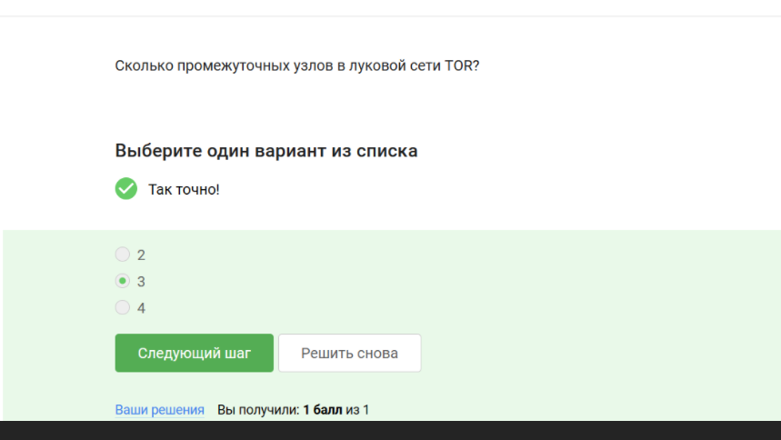{#fig-014 width=70%}

## 15

В браузере тор не видно промежуточный и охранный узел ([рис. @fig-015])

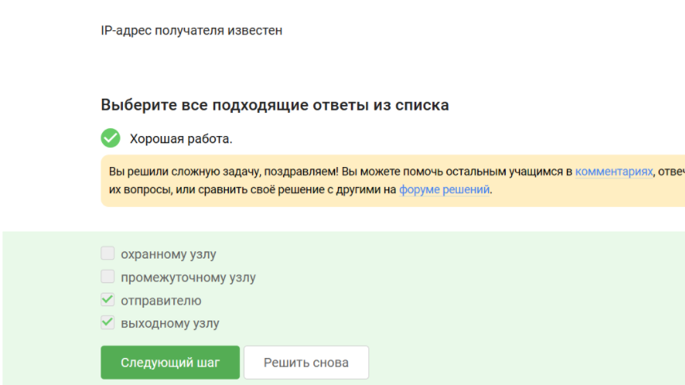{#fig-015 width=70%}

## 16
 
Общий секретный ключ генерируется со всеми узлами через которые идет передача ([рис. @fig-016])

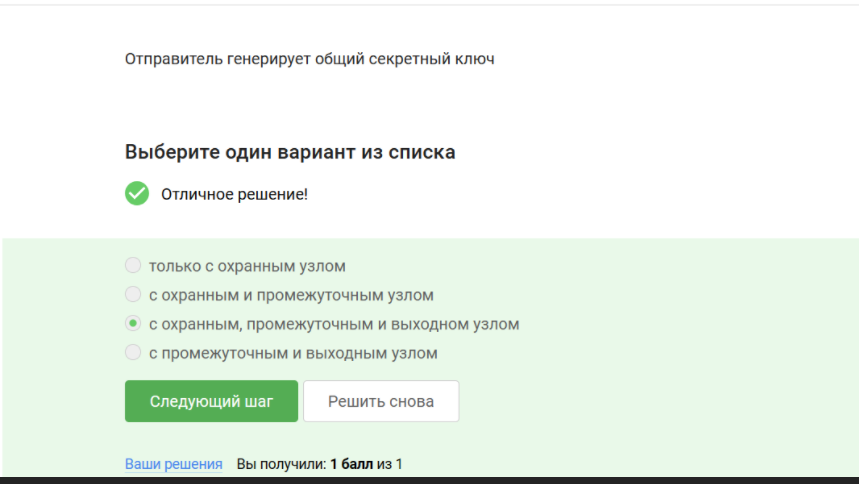{#fig-016 width=70%}

## 17

Получатель не должен использовать браузер тор для успешного получения пакетов ([рис. @fig-017])

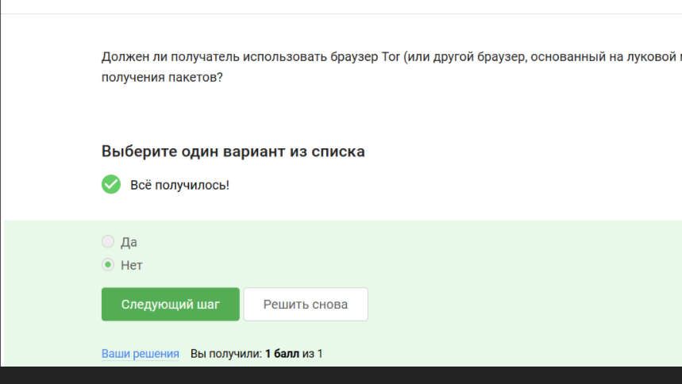{#fig-017 width=70%}

## 18

Верное опрередение wi-fi ([рис. @fig-018])

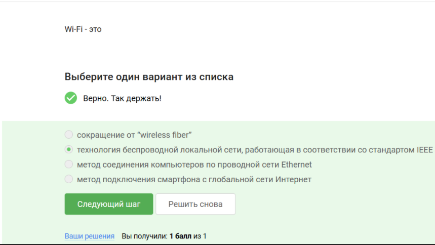{#fig-018 width=70%}

## 19

Протокол wi-fi работает на канальном уровне ([рис. @fig-019])

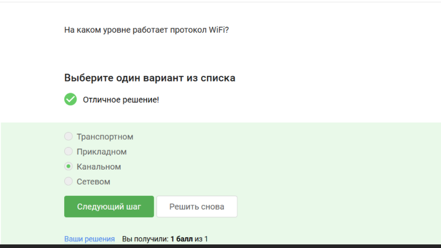{#fig-019 width=70%}

## 20

WEP не является безопасным методом обеспечения шифрования и аутентификации в сети wi-fi ([рис. @fig-020])

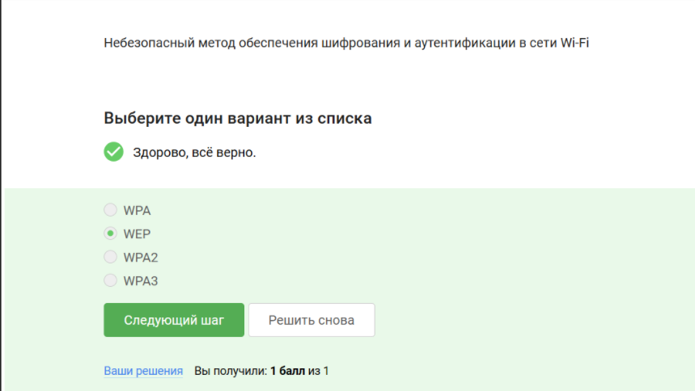{#fig-020 width=70%}

## 21

После аутентификации устройств данные передаются в зашифрованном виде ([рис. @fig-021])

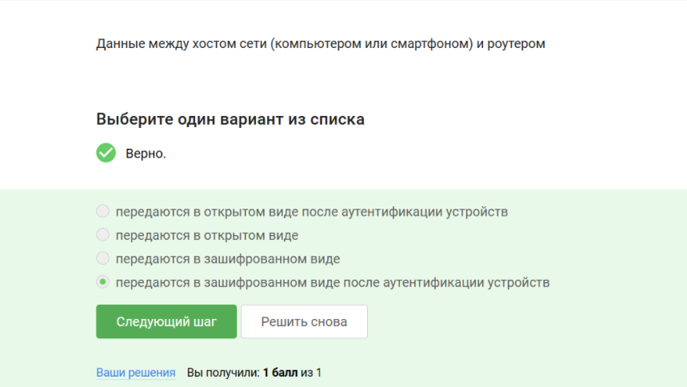{#fig-021 width=70%}

## 22

WPA2 Personal используется для аутентификации домащней сети ([рис. @fig-022])

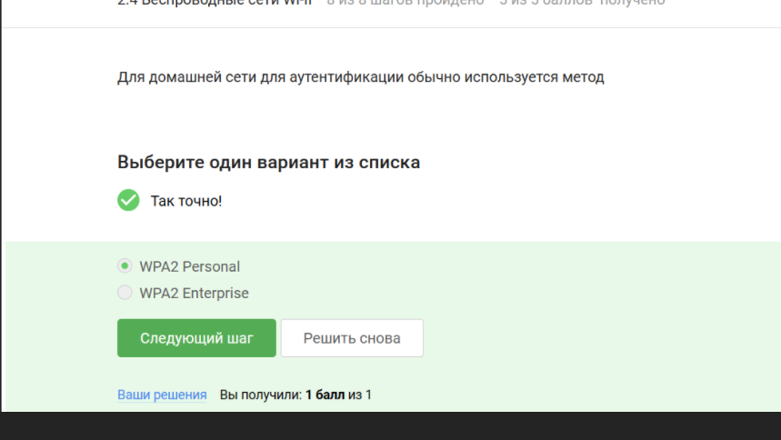{#fig-022 width=70%}
