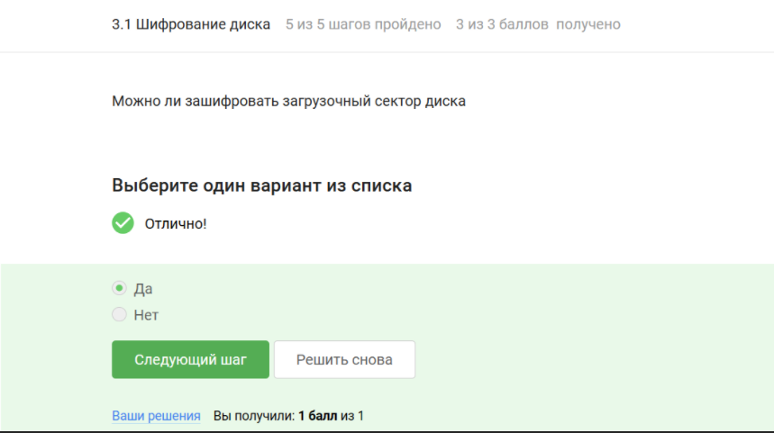
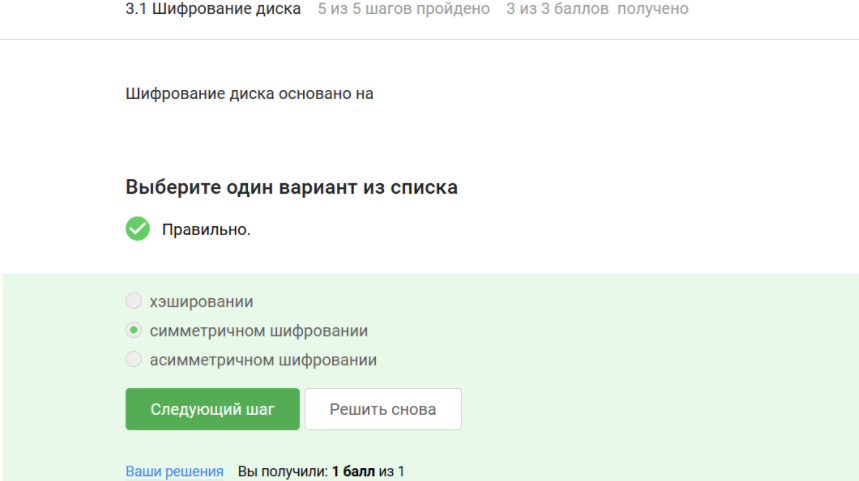
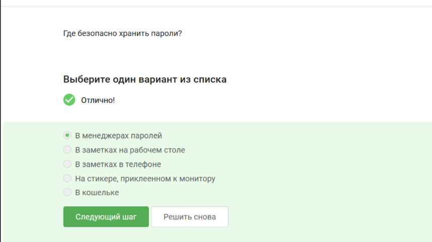

---
## Author
author:
  name: Репкина Елизавета Андреевна
  email: 1132246753@rudn.ru
  affiliation:
    - name: Российский университет дружбы народов
      country: Российская Федерация
      postal-code: 117198
      city: Москва
      address: ул. Миклухо-Маклая, д. 6

## Title
title: "Внешний курс. Раздел 2."
---

 Информация

## Докладчик

:::::::::::::: {.columns align=center}
::: {.column width="70%"}

  * Репкина Елизавета Андреевна
  * НКАбд-04-24
  
:::
::: {.column width="30%"}

:::
::::::::::::::

# Вводная часть

## Цели и задачи

Прохождение внешнего курса "Основы кибербезопасности". Получение знаний в сфере кибербезопасности.

# Прохождение раздела

## 1

Шифрование переводит данные в нечитаемый код ([рис. @fig-001])

{#fig-001 width=70%}

## 2

Шифрование диска основано на симметричном основании ([рис. @fig-002])

{#fig-002 width=70%}

## 3

VeraCrypt и BitLocker используются для шифрования жесткого диска ([рис. @fig-003])

{#fig-003 width=70%}

## 4

Чем сложнее пароль-тем лучше ([рис. @fig-004])

{#fig-004 width=70%}

## 5

В менеджере паролей безопасно хранить пароль ([рис. @fig-005])

{#fig-005 width=70%}

## 6

Капча защищает от автоматизированных атак ([рис. @fig-006])

{#fig-006 width=70%}

## 7

Хэширование паролей применяется для того чтобы не хранить пароли в открытом виде ([рис. @fig-007])

{#fig-007 width=70%}

## 8

Соленые пароли не помогут ([рис. @fig-008])

{#fig-008 width=70%}

## 9

Все меры защищают от утечек ([рис. @fig-009])

{#fig-009 width=70%}

## 10

Фишинговые ссылки похожи на обычные ([рис. @fig-010])

{#fig-010 width=70%}

## 11

Фишинговый имейл может прийти от кого угодно ([рис. @fig-011])

{#fig-011 width=70%}

## 12

Понятие email спуфинга ([рис. @fig-012])

{#fig-012 width=70%}

## 13

Троян маскируется ([рис. @fig-013])

{#fig-013 width=70%}

## 14

Ключ шифрования в сигнале формируется при пераом сообщении от отправителя ([рис. @fig-014])

{#fig-014 width=70%}

## 15

Благодаря сквозному шифрованию сообщения передаются по узлам связи в зашифрованном виде ([рис. @fig-015])

{#fig-015 width=70%}

