---
## Author
author:
  name: Репкина Елизавета Андреевна
  
  
## Title
title: "Прохождение внешнего курса"
subtitle: "Раздел 2. Защита ПК/телефона."
license: "CC BY"
---

# Цель работы

Прохождение внешнего курса "Основы кибербезопасности". Получение знаний в сфере кибербезопасности.

# Теоретическое введение

Пароль - позволяет потом разблокировать этот ключ шифрования и дешифрования. Иногда вас спросят запомнить довольно длинный пароль. Вот, например, у меня на картинке пример пароля, предложенного утилитой шифрования в MacOS, и этот пароль вам нужно сохранить (где и как его хранить, мы также поговорим подробнее). Сейчас стоит запомнить, что на первом шаге мы генерируем ключ. Что мы с ним потом делаем? Потом мы с этим ключом шифрует. Программа берет этот ключ, берет наши данные, будь то весь жесткий диск или какой-то его сегмент или может быть даже загрузочный сегмент, и шифрует данные с помощью ключа. На выходе мы с вами получаем данные в зашифрованном виде. Когда мы с вами хотим получить доступ к нашим зашифрованным данным, жесткому диску или загрузочному сектору, мы дешифруем, при этом работает программа, алгоритм дешифрования. Алгоритм дешифрования берет то же самый ключ, зашифрованные данные и выдает нам дешифрованные данные: либо наши файлы в открытом виде, либо, если мы шифровали загрузочный сектор операционной системы, нам загрузят эту операционную систему. 

Поговорим немного о деталях, о том, как происходит шифрование. Шифрование больших объемов данных, например, жесткого диска или сегмента жесткого диска или какой-то большой флешки, осуществляется с помощью симметричного шифрования, как правило, алгоритма AES. Это американский стандарт симметричного шифрования, он также используется для конфиденциальной передачи данных по сети. Это эффективный алгоритм, который реализован в процессорах быстро, то есть на аппаратном уровне. Благодаря тому, что это хороший алгоритм, пользователь практически не наблюдает задержек в работе, то есть данные шифруются-дешифруются быстро. Как правило, это происходит на заднем фоне, мы можем при этом работать на компьютере, будут происходить какие-то параллельные операции на шифрование и дешифрование. 

На современных процессорах семейства Intel встроен TPM модуль или TPM криптопроцессор; TPM - это аббревиатура от Trusted Platform Module, и этот криптопроцессор позволяет, во-первых, эффективно шифровать, то есть на нем аппаратно реализован алгоритм шифрования AES, а во-вторых, позволяет хранить этот самый ключ, с помощью которого мы шифровали и дешифровали, на специальном сегменте блока данных, который защищен от злоумышленников. 

Как я уже сказала, шифровать можно не только жесткий диск, где мы храним файлы, можно шифровать и загрузочный сектор диска. Это тот сектор, который включается сразу после того, как мы стартовали компьютер. Компьютер считывает данные в сегменте, который хранит у себя загрузочные файлы операционной системы, и мы получаем либо свой рабочий стол, либо запрос на авторизацию для доступа к нашему рабочему столу. Вот для того, чтобы зашифровать загрузочный сектор, мы тоже можем использовать методы шифрования. В этом случае вас попросят ввести ключ или скорее даже пароль к этому ключу при самом запуске компьютера. 

Важный вопрос во всем этом алгоритме - это где хранить ключ. Очевидно, что хранить ключ на том же самом диске, что мы шифруем, бесполезно, потому что, если вдруг мы его забыли или потеряли, мы его никак не получим, потому что все данные на диске зашифрованы, они хранятся в зашифрованном виде, пока мы их не дешифруем, пока мы не попросим к ним доступ. Одна из довольно популярных практик - это хранение ключа у администратора. Иногда ключи хранятся на физических носителях: на флешках или на так называемых токенах. Есть ещё сервисы, которые предлагают многие антивирусные компании, типа Касперского - хранить на своих облачных защищенных серверах ваши ключи. Это уже зависит от того, как вы администрируете, какая политика безопасности есть у вас и какая вам ближе. Но важно помнить то, что хранить ключ шифрования на том же самом диске, что шифруете, это бессмысленно.

Поговорим теперь о том, какие есть утилиты для шифрования носителей. Во всех популярных операционных системах есть встроенные утилиты, которые позволяют шифровать жесткий диск: для Windows этo Bitlocker, в Linux – LUKS, в MacOS – это FileVault. Кроме того, есть и сторонние опенсорсные (open source) программы, то есть бесплатные: это Veracrypt, PGPDisk, которые вы можете установить себе и использовать их для шифрования ваших жестких дисков, загрузочных секторов или флешек. 

# Выполнение лабораторной работы

Шифрование переводит данные в нечитаемый код ([рис. @fig-001])

{#fig-001 width=70%}

Шифрование диска основано на симметричном основании ([рис. @fig-002])

{#fig-002 width=70%}

VeraCrypt и BitLocker используются для шифрования жесткого диска ([рис. @fig-003])

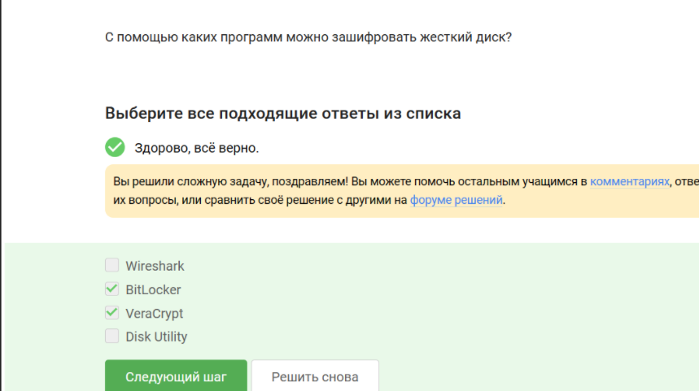{#fig-003 width=70%}

Чем сложнее пароль-тем лучше ([рис. @fig-004])

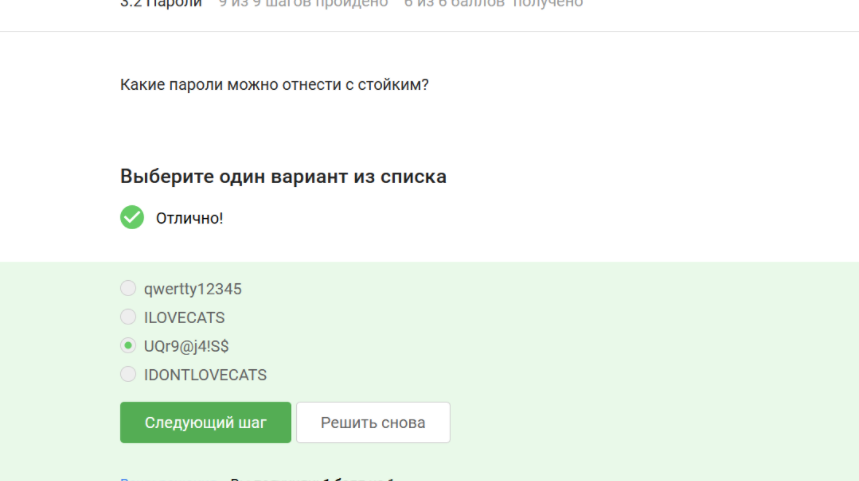{#fig-004 width=70%}

В менеджере паролей безопасно хранить пароль ([рис. @fig-005])

{#fig-005 width=70%}

Капча защищает от автоматизированных атак ([рис. @fig-006])

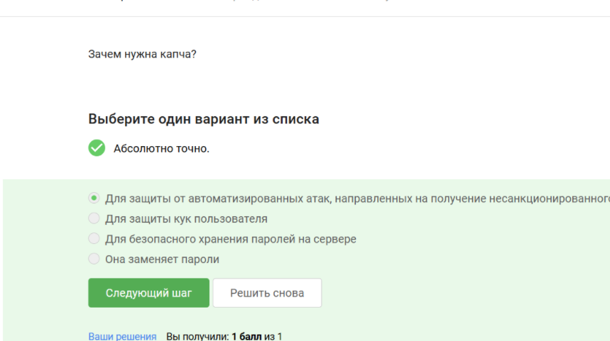{#fig-006 width=70%}

Хэширование паролей применяется для того чтобы не хранить пароли в открытом виде ([рис. @fig-007])

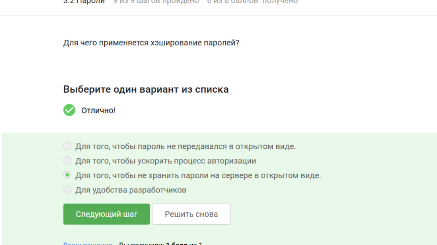{#fig-007 width=70%}

Соленые пароли не помогут ([рис. @fig-008])

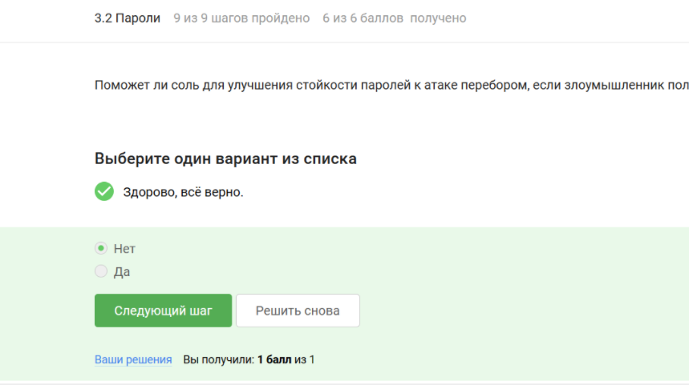{#fig-008 width=70%}

Все меры защищают от утечек ([рис. @fig-009])

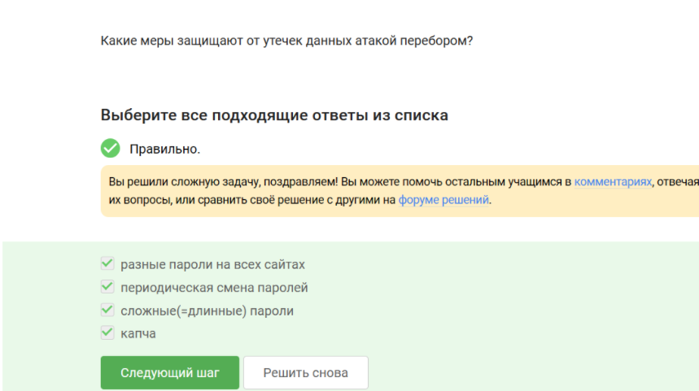{#fig-009 width=70%}

Фишинговые ссылки похожи на обычные ([рис. @fig-010])

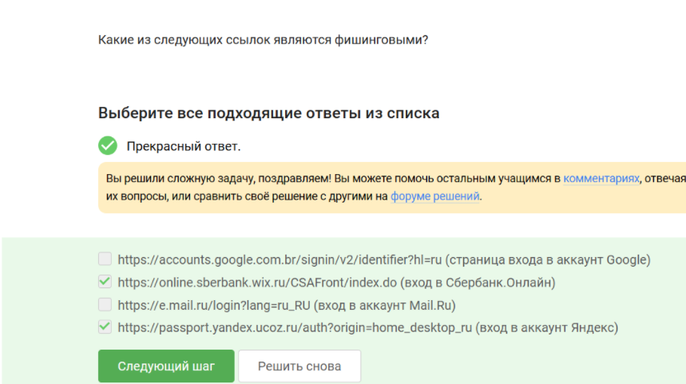{#fig-010 width=70%}

Фишинговый имейл может прийти от кого угодно ([рис. @fig-011])

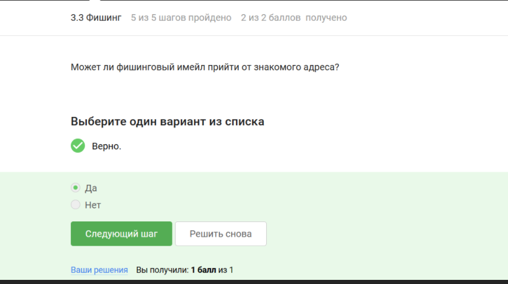{#fig-011 width=70%}

Понятие email спуфинга ([рис. @fig-012])

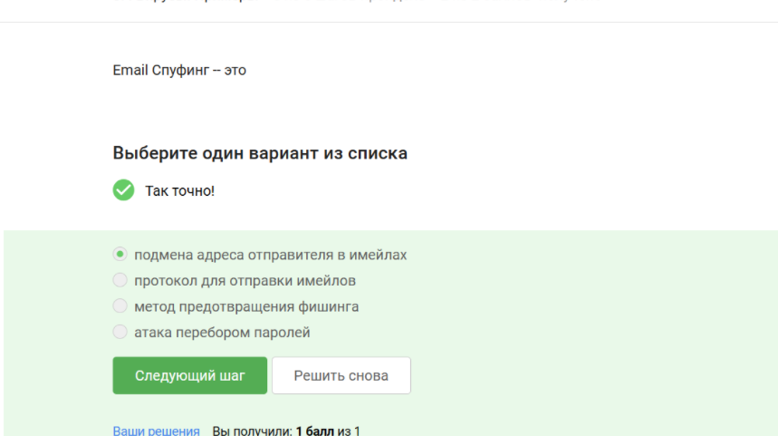{#fig-012 width=70%}

Троян маскируется ([рис. @fig-013])

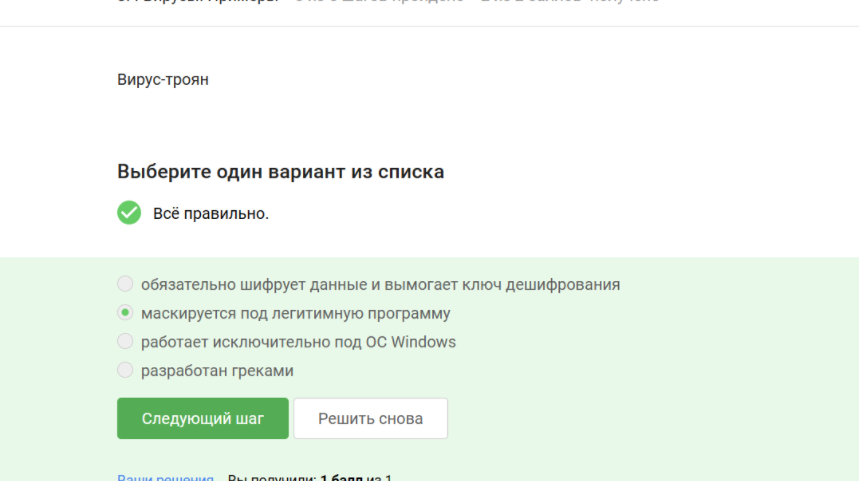{#fig-013 width=70%}

Ключ шифрования в сигнале формируется при пераом сообщении от отправителя ([рис. @fig-014])

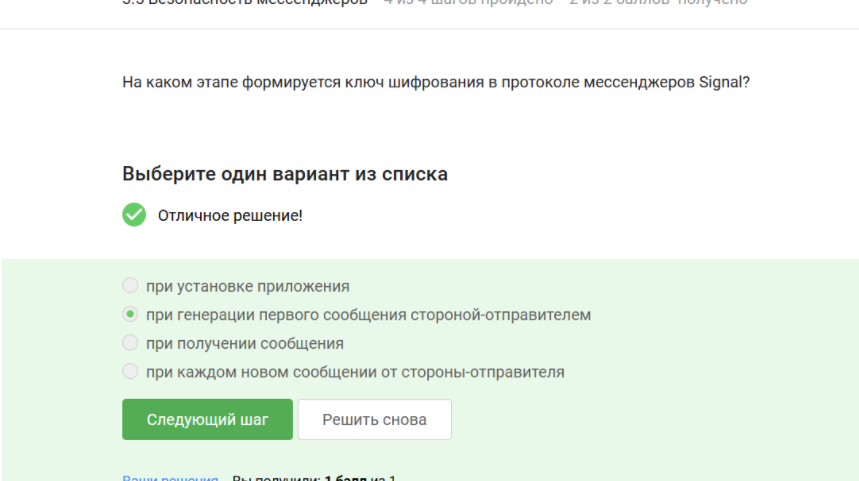{#fig-014 width=70%}

Благодаря сквозному шифрованию сообщения передаются по узлам связи в зашифрованном виде ([рис. @fig-015])

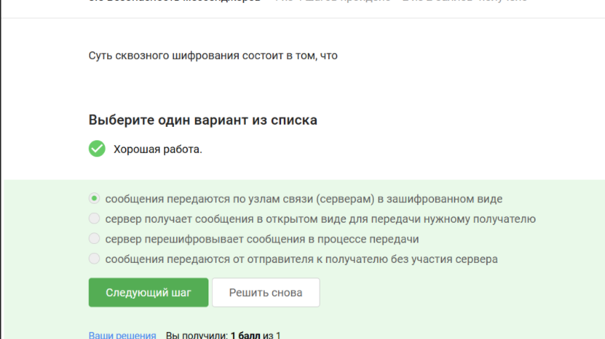{#fig-015 width=70%}

# Выводы

В результате прохождения 2 раздела курса я приобрела знания о защите пк и телефонов.

# Список литературы{.unnumbered}

::: {#refs}
:::
