---
## Author
author:
  name: Репкина Елизавета Андреевна
  email: 1132246753@rudn.ru
  affiliation:
    - name: Российский университет дружбы народов
      country: Российская Федерация
      postal-code: 117198
      city: Москва
      address: ул. Миклухо-Маклая, д. 6

## Title
title: "Внешний курс. Раздел 3."
---

 Информация

## Докладчик

:::::::::::::: {.columns align=center}
::: {.column width="70%"}

  * Репкина Елизавета Андреевна
  * НКАбд-04-24
  
:::
::: {.column width="30%"}

:::
::::::::::::::

# Вводная часть

## Цели и задачи

Прохождение внешнего курса "Основы кибербезопасности". Получение знаний в сфере кибербезопасности.

# Прохождение раздела

## 1

В ассиметричных криптографических примитивах обе стороны имеют пару ключей ([рис. @fig-001])

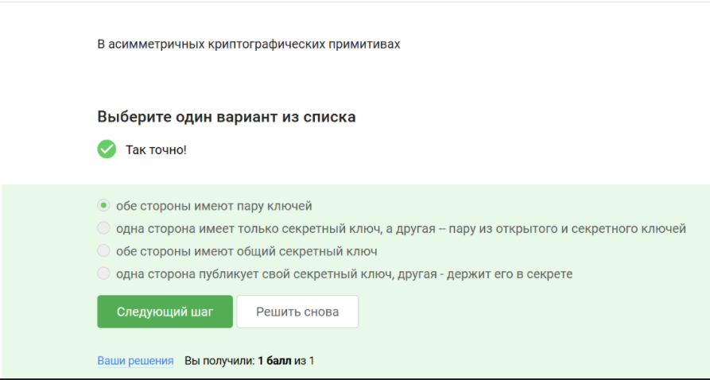{#fig-001 width=70%} 

## 2

Криптографическая хэш-функция не обеспечивает конфиденциальность ([рис. @fig-002])

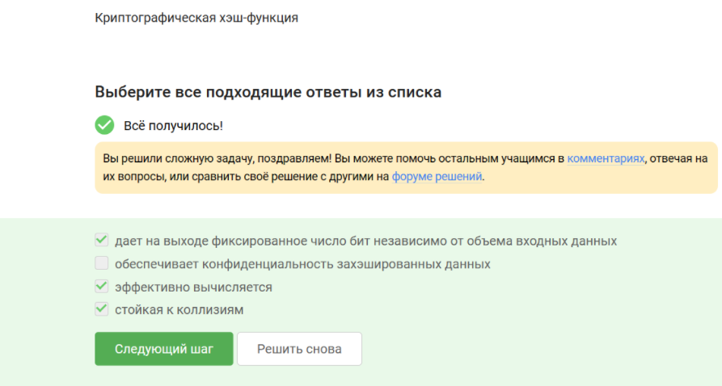{#fig-002 width=70%}

## 3

AES и SHA2 не относятся  к алгоритмам цифровой подписи ([рис. @fig-003])

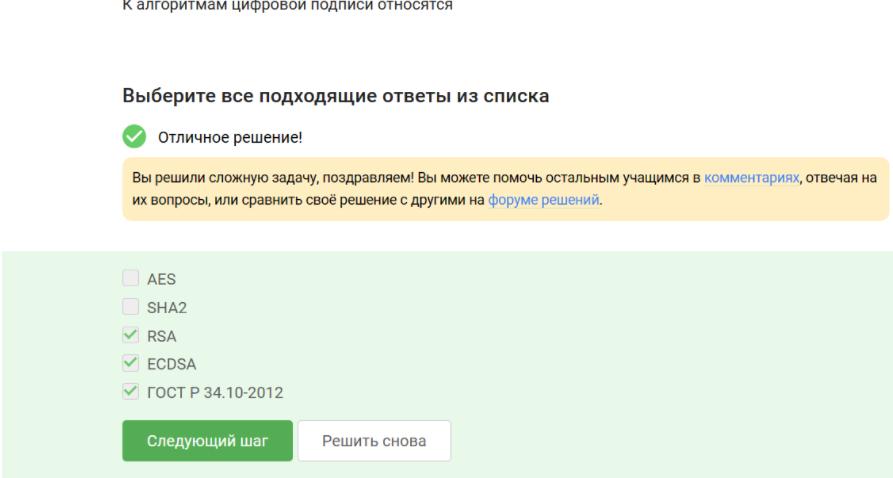{#fig-003 width=70%}

## 4

Код аутентификации сообщения-симметричный примитив ([рис. @fig-004])

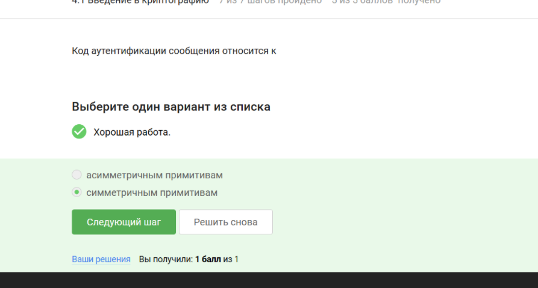{#fig-004 width=70%}

## 5

Верное определение обмена ключам Дифии-Хэллмана ([рис. @fig-005])

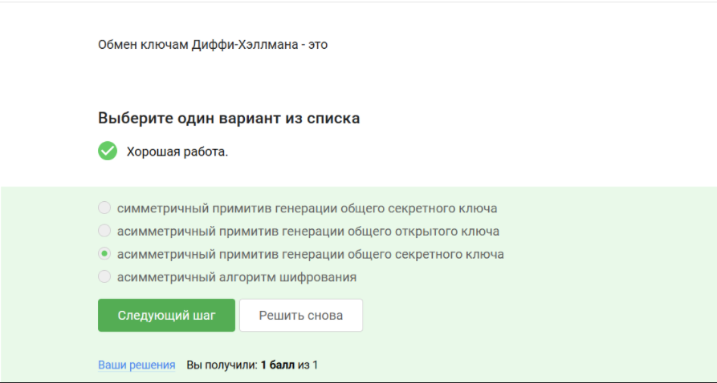{#fig-005 width=70%}

## 6

Протокол электронной подписи-протокол с откртым ключом([рис. @fig-006])

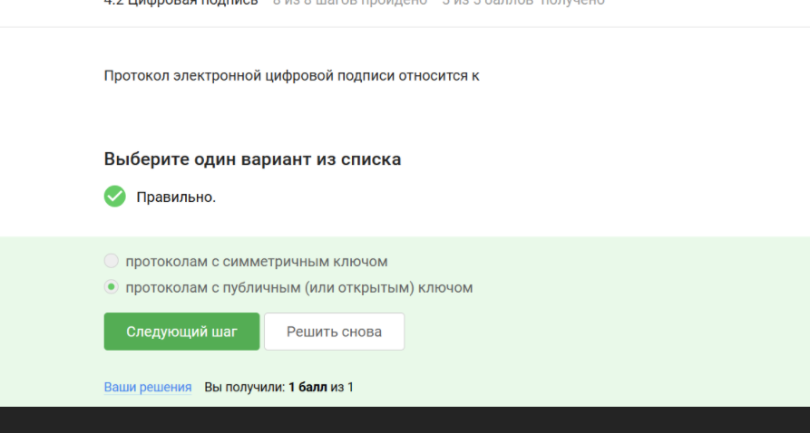{#fig-006 width=70%}

## 7

Требуется подпись,откртый ключ, сообщение ([рис. @fig-007])

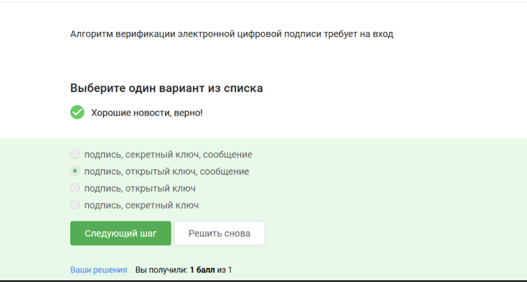{#fig-007 width=70%}

## 8

Электронная цифровая подпись не связана с конфиденциальностью ([рис. @fig-008])

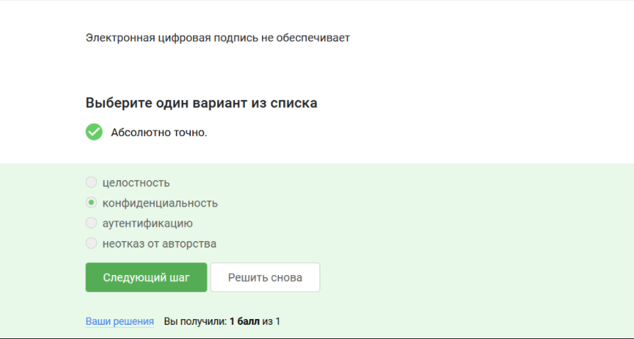{#fig-008 width=70%}

## 9

Требуется использовать усиленную квалифицированная электронная подпись для ФНС ([рис. @fig-009])

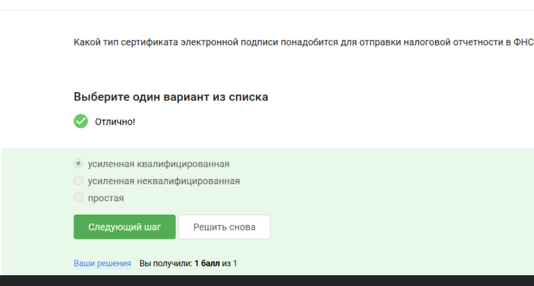{#fig-009 width=70%}

## 10

Чертифицированный центр дает сертификат ключа для проверки эл. подписи ([рис. @fig-010])

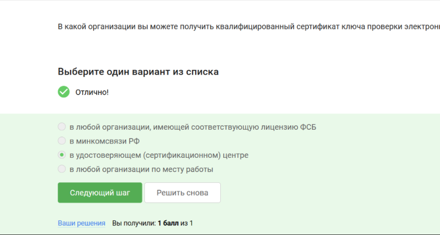{#fig-010 width=70%}

## 11

МастерКард и МИР являются платежными системами ([рис. @fig-011])

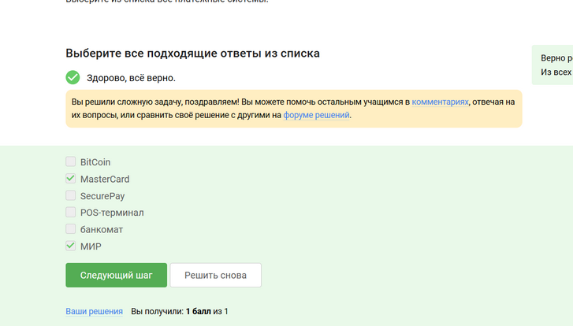{#fig-011 width=70%}

## 12

верный ответ на вопрос ([рис. @fig-012])

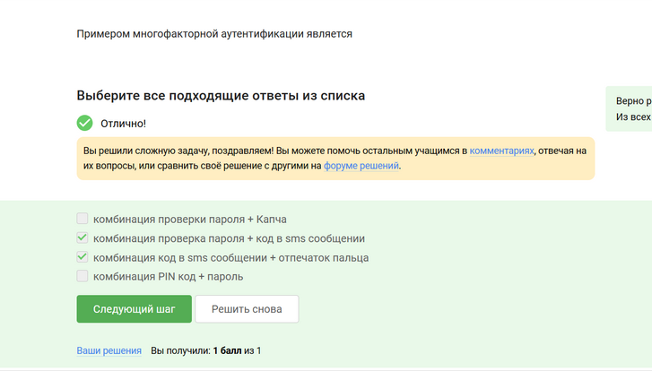{#fig-012 width=70%}

## 13

Сногофакторная аутентификация покупателя перед банком-эмитентом используется при онлайн платежах ([рис. @fig-013])

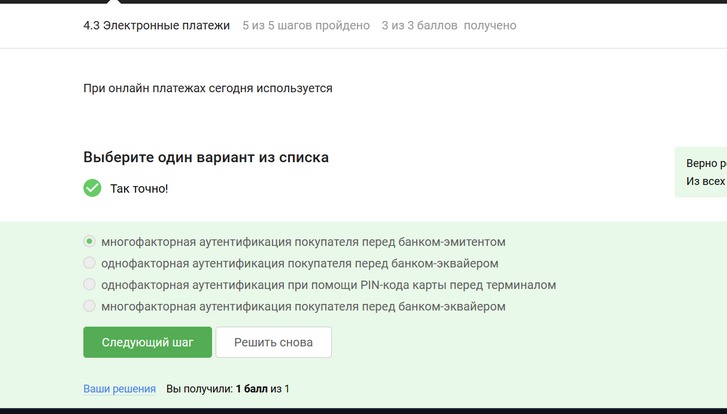{#fig-013 width=70%}

## 14

Используется сложность нахождения прообраза([рис. @fig-014])

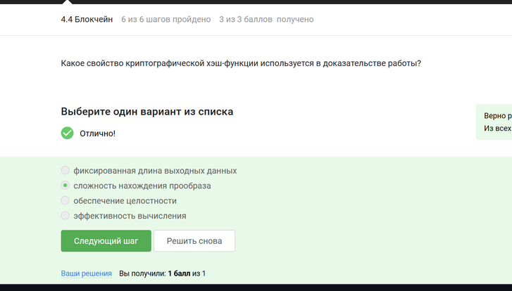{#fig-014 width=70%}

## 15

Все ответы верны ([рис. @fig-015])

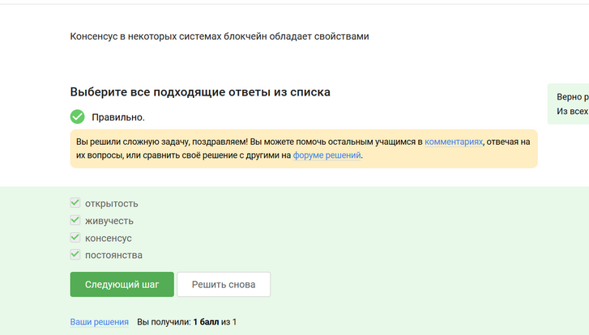{#fig-015 width=70%}

## 16

Участники блокчейна хранят секретные ключи цифровой подписи ([рис. @fig-016])

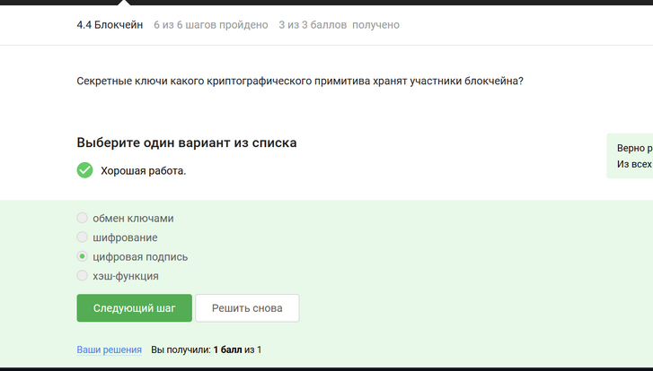{#fig-016 width=70%}

