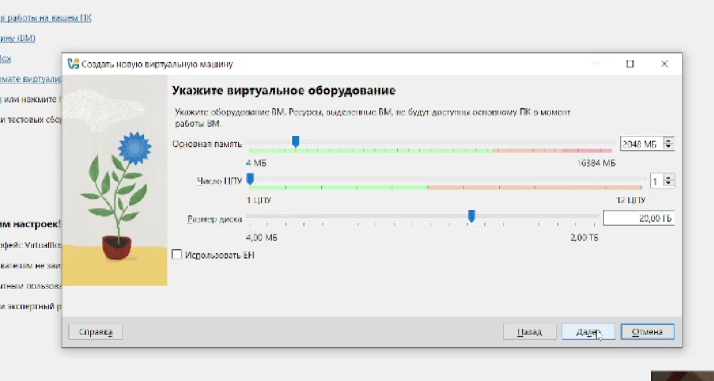
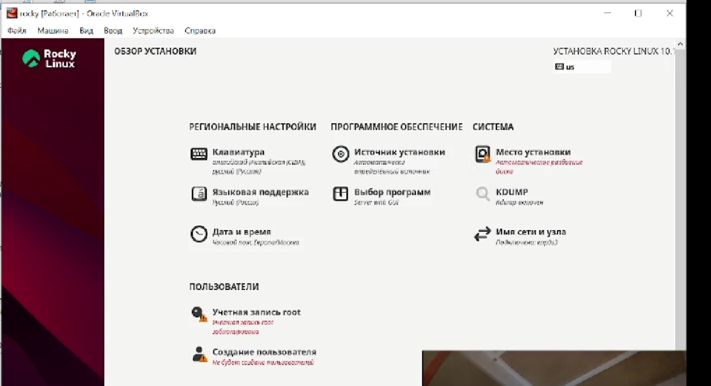
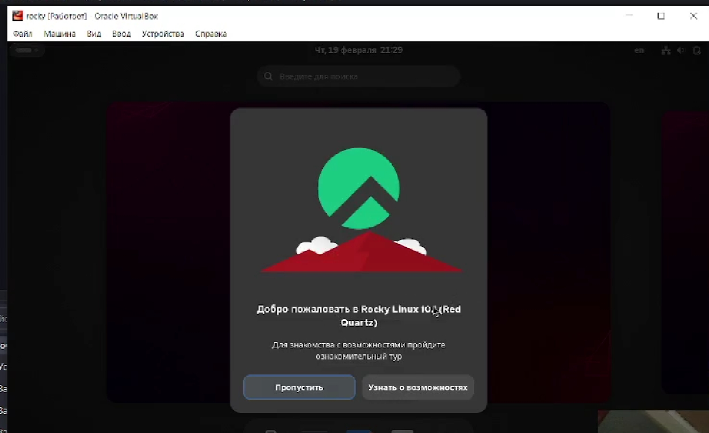

---
## Author
author:
  name: Репкина Елизавета Андреевна
  email: 1132246753@rudn.ru
  affiliation:
    - name: Российский университет дружбы народов
      country: Российская Федерация
      postal-code: 117198
      city: Москва
      address: ул. Миклухо-Маклая, д. 6

## Title
title: "Отчёт по лабораторной работе №1"
---

# Цель работы

Целью данной работы является приобретение практических навыков
установки операционной системы на виртуальную машину, настройки минимально необходимых для дальнейшей работы сервисов.

# Задание

1. Установка ОС
2. Настройка ОС

# Выполнение лабораторной работы

Скачиваю необходимое програмное ПО. Устанавливаю операционной системы Linux
(дистрибутив Rocky (https://rockylinux.org/))
Настравиваю ВМ ([рис. @fig-001]).

{#fig-001 width=70%}

Запускаю виртуальную машину , выбираю English в качестве
языка интерфейса и перехожу к настройкам установки операционной системы ([рис. @fig-002]).

{#fig-003 width=70%}

После завершения установки операционной системы корректно перезапускаю виртуальную машину и при запросе принимаю условия
лицензии  ([рис. @fig-003]).

{#fig-003 width=70%}

#Вопросы 

Версия ядра Linux: 6.12.0-124.8.1.el10_1.x86_64

Частота процессора: 2096.062 МГц

Модель процессора: AMD Ryzen 5 5500U with Radeon Graphics

Объем доступной оперативной памяти: 1200348 kB (примерно 1.14 ГБ)

Тип обнаруженного гипервизора: oracle (Oracle VM VirtualBox)

Тип файловой системы корневого раздела: xfs

#Контрольные вопросы 

**1. Какую информацию содержит учётная запись пользователя?**
Имя пользователя, UID, GID, домашний каталог, зашифрованный пароль, командная оболочка, описание пользователя.

**2. Команды терминала и примеры:**

Справка по команде:
man ls
ls --help

Перемещение по файловой системе:
cd /home
cd ..
cd ~
cd -

Просмотр содержимого каталога:
ls
ls -l
ls -a
ls -lh

Определение объёма каталога:
du -sh /home
du -h
df -h

Создание и удаление каталогов и файлов:
mkdir newdir
touch file.txt
rm file.txt
rm -r newdir
rmdir emptydir
cp file.txt copy.txt
mv file.txt new.txt

Задание прав на файл или каталог:
chmod 755 script.sh
chmod u+x file.txt
chmod go-w file.txt
chown user:group file.txt

Просмотр истории команд:
history
history 10
!!
!100
Ctrl+R

**3. Что такое файловая система? Примеры с характеристикой.**
Файловая система определяет способ хранения и доступа к данным на диске.

ext4 — журналируемая ФС, используется в Linux по умолчанию, поддерживает большие файлы и тома.
xfs — высокопроизводительная журналируемая ФС, хороша для больших файлов и высокой нагрузки.
btrfs — современная ФС с поддержкой снапшотов, сжатия и проверки целостности данных.
ntfs — ФС Windows, поддерживает большие файлы, журналирование, права доступа.
fat32 — старая ФС, ограничение на размер файла 4 ГБ, нет журналирования, совместима со всем.

**4. Как посмотреть, какие файловые системы подмонтированы в ОС?**
mount
df -h
findmnt
cat /proc/mounts

**5. Как удалить зависший процесс?**
Найти PID процесса:
ps aux | grep имя_процесса
top
pidof имя_процесса

Отправить сигнал завершения:
kill PID
kill -9 PID
pkill имя_процесса
killall имя_процесса

# Выводы

Я преобрела практические навыки установки операционной системы на виртуальную машину, настройки минимально необходимых для дальнейшей работы сервисов.

# Список литературы{.unnumbered}

::: {#refs}
:::
