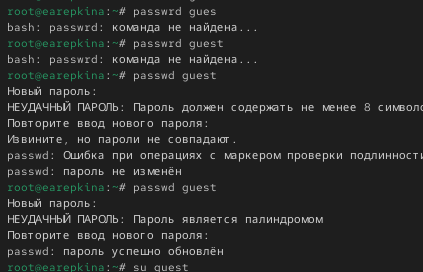
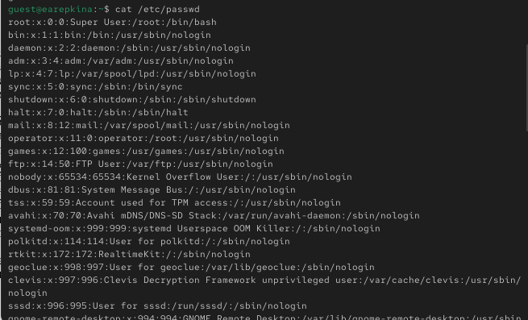
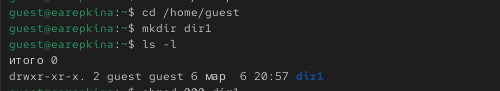

---
## Author
uthor:
  name: Репкина Елизавета Андреевна
  email: 1132246753@rudn.ru
  affiliation:
    - name: Российский университет дружбы народов
      country: Российская Федерация
      postal-code: 117198
      city: Москва
      address: ул. Миклухо-Маклая, д. 6
## Title
title: Лабораторная работа № 2.
subtitle: Дискреционное разграничение прав в Linux. Основные атрибуты
---

# Информация

## Докладчик

:::::::::::::: {.columns align=center}
::: {.column width="70%"}

  * Репкина Елизавета Андреевна
  * Российский университет дружбы народов им. П. Лумумбы
  * <https://lizeeew.github.io/ru/>

:::
::::::::::::::

# Вводная часть

## Цели и задачи

Получение практических навыков работы в консоли с атрибутами файлов, закрепление теоретических основ дискреционного разграничения доступа в современных системах с открытым кодом на базе ОС Linux1

# Выполнение лабораторной работы

## Создание пользователя
 • Создан пользователь guest и установлен пароль.
 • Использовались команды: useradd и passwd.
 • Результат выполнения:

{#fig-001 width=70%}

## Информация о пользователе
 • Вход в систему от имени guest.
 • Использованы команды: whoami, id, groups.
 • Получены:
 • Имя пользователя
 • UID и GID
 • Список групп  
 
{#fig-002 width=70%}

## Просмотр файла пользователей
 • Системный файл /etc/passwd содержит информацию обо всех пользователях.
 • Команда grep использовалась для поиска строки пользователя guest.

{#fig-003 width=70%}

## Домашние директории
 • Команда: ls -l /home
 • Позволяет увидеть домашние директории пользователей и права доступа.
{#fig-004 width=70%}
 
 
## Расширенные атрибуты
 • Проверка атрибутов файлов и директорий: lsattr
 • Результаты выполнения команды:
 
{#fig-005 width=70%}

## Работа с директориями
 • Создана директория dir1 в домашней директории guest: mkdir dir1.
 • Проверка прав доступа и атрибутов: ls -l, lsattr. 

{#fig-006 width=70%}

# Таблицы

## Минимальные права для совершения операций

| Операция | Минимальные права на директорию | Минимальные права на файл |
|---|---|---|
| Создание файла | 3 (wx) | — |
| Удаление файла | 3 (wx) | — |
| Чтение файла | 1 (x) | 4 (r) |
| Запись в файл | 1 (x) | 2 (w) |
| Переименование файла | 3 (wx) | — |
| Создание поддиректории | 3 (wx) | — |
| Удаление поддиректории | 3 (wx) | — |

## Выводы

 • Получены практические навыки работы с атрибутами файлов и правами доступа в Linux.
 • Освоены команды для создания пользователей, проверки информации и управления директориями.

## Итоговый слайд

«Лучший способ предсказать будущее — создать его» — Питер Друкер

