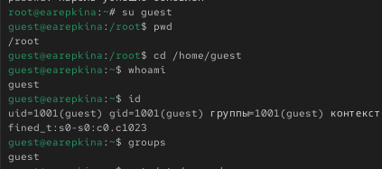
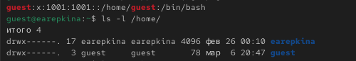
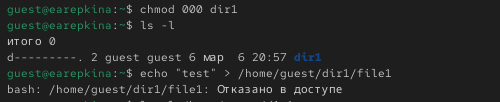

---
## Author
author:
  name: Репкина Елизавета Андреевна
  email: 1132246753@rudn.ru
  affiliation:
    - name: Российский университет дружбы народов
      country: Российская Федерация
      postal-code: 117198
      city: Москва
      address: ул. Миклухо-Маклая, д. 6

## Title
title: "Отчёт по лабораторной работе №1"
---

# Цель работы

Получение практических навыков работы с атрибутами файлов и правами доступа в операционной системе Linux.

# Выполнение лабораторной работы

В начале работы была выполнена команда создания пользователя guest и установка пароля для данного пользователя. Для этого были использованы команды useradd и passwd. Результат выполнения команд показан на [рис. @fig-001].

{#fig-001 width=70%}

Далее был выполнен вход в систему от имени пользователя guest. После этого были использованы команды whoami, id и groups для определения имени пользователя, его идентификатора (UID), идентификатора группы (GID) и списка групп, к которым принадлежит пользователь. Результат выполнения команд представлен на [рис. @fig-002].

{#fig-002 width=70%}

Затем был просмотрен системный файл /etc/passwd, содержащий информацию обо всех пользователях системы. С помощью команды grep была найдена строка, относящаяся к пользователю guest. Результат показан на [рис. @fig-003].

{#fig-003 width=70%}

После этого был получен список директорий, расположенных в каталоге /home, с помощью команды ls -l /home. Данная команда позволяет увидеть существующие домашние директории пользователей и установленные для них права доступа. Результат выполнения команды представлен на [рис. @fig-004].

{#fig-004 width=70%}

Далее была проверена информация о расширенных атрибутах файлов и директорий с помощью команды lsattr. Результаты выполнения данной команды показаны на [рис. @fig-005].

{#fig-005 width=70%}

В домашней директории пользователя guest была создана директория dir1 с помощью команды mkdir. После этого были просмотрены права доступа и атрибуты данной директории с помощью команд ls -l и lsattr. Результаты представлены на [рис. @fig-006].

{#fig-006 width=70%}

## Таблица 2.2 Минимальные права для совершения операций

| Операция | Минимальные права на директорию | Минимальные права на файл |
|---|---|---|
| Создание файла | 3 (wx) | — |
| Удаление файла | 3 (wx) | — |
| Чтение файла | 1 (x) | 4 (r) |
| Запись в файл | 1 (x) | 2 (w) |
| Переименование файла | 3 (wx) | — |
| Создание поддиректории | 3 (wx) | — |
| Удаление поддиректории | 3 (wx) | — |

# Выводы

Я получила практические навыки работы с атрибутами файлов и правами доступа в операционной системе Linux.

# Список литературы{.unnumbered}

::: {#refs}
:::
