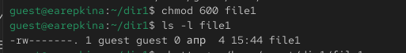
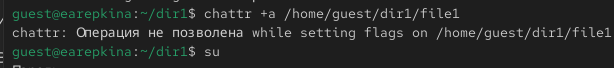
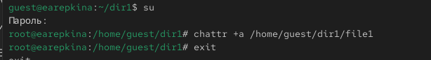
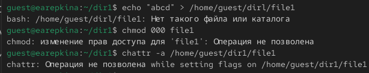
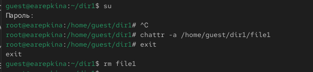
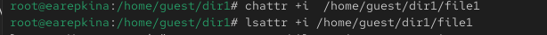
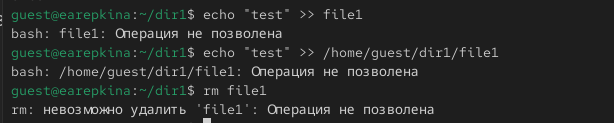

---
## Author
author:
  name: Репкина Елизавета Андреевна
  email: 1132246753@rudn.ru
  affiliation:
    - name: Российский университет дружбы народов
      country: Российская Федерация
      postal-code: 117198
      city: Москва
      address: ул. Миклухо-Маклая, д. 6

## Title
title: "Лабораторная работа №4"
---

# Информация

## Докладчик

:::::::::::::: {.columns align=center}
::: {.column width="70%"}

  * Репкина Елизавета Андреевна
  * Российский университет дружбы народов им. П. Лумумбы

:::
::: {.column width="30%"}

:::
::::::::::::::

# Вводная часть

## Актуальность

- Работа с расширенными атрибутами файлов в Linux важна для безопасности данных
- Атрибуты `a` и `i` позволяют контролировать запись и удаление файлов
- Позволяет на практике понять дискреционное разграничение прав

## Объект и предмет исследования

- **Объект:** Файлы и каталоги в Linux
- **Предмет:** Расширенные атрибуты (`a`, `i`) и их влияние на операции пользователя

## Цели и задачи

- Ознакомиться с расширенными атрибутами файлов
- Научиться устанавливать и проверять атрибуты с помощью `chattr` и `lsattr`
- Проверить влияние атрибутов на запись, удаление и переименование файлов

---

# Материалы и методы

- Операционная система Linux
- Пользователь guest и права root
- Команды:
  - `lsattr`, `chattr`
  - `chmod`, `echo`, `cat`, `rm`, `mv`
- Методы: создание, изменение, защита и удаление файлов

---
# Ход работы
## 1. **Проверка расширенных атрибутов файла**  

   От имени пользователя `guest` была выполнена команда:
   lsattr /home/guest/dir1/file1 ([рис. @fig-001]).

{#fig-001 width=70%}

## 2. **Изменение прав доступа к файлу**
Установлены права, разрешающие чтение и запись для владельца([рис. @fig-002]).

{#fig-002 width=70%}

## 3. **Установка расширенного атрибута а**
Попытка установки оказалась неудачной ([рис. @fig-003]).

{#fig-003 width=70%}

## 4. **Установка атрибута а от имени root**
Устанавливаю расширенный атрибут а от имени суперпользователя ([рис. @fig-004]).

{#fig-004 width=70%}

## 5. **Попытка записи в файл и чтение**
Выполняю дозапись слова test ([рис. @fig-005]).

{#fig-005 width=70%}

## 6. **Использование атрибута а**
Пытаюсь удалить, перезаписать и переименовать файл с атрибутом а([рис. @fig-006]).

{#fig-006 width=70%}

## 7. **Снятие атрибута а**
Снимаю атрибут а с файла от имени суперпользователя ([рис. @fig-007]).

{#fig-007 width=70%}

## 8. **Установка атрибута i**

Заменяю атрибут а на i ([рис. @fig-008]).

{#fig-008 width=70%}

## 9. **Проверка защищенности**

Файл полнстью защищен, в следствии чего все операции неудались ([рис. @fig-009]).

{#fig-009 width=70%}

## Таблица 4.1 — Влияние атрибутов на действия пользователя

| Атрибут | Можно дописать | Можно перезаписать | Можно удалить | Можно переименовать |
|---------|----------------|------------------|---------------|-------------------|
| a       | ✅ Да          | ❌ Нет           | ❌ Нет        | ❌ Нет            |
| i       | ❌ Нет         | ❌ Нет           | ❌ Нет        | ❌ Нет            |
| нет     | ✅ Да          | ✅ Да            | ✅ Да         | ✅ Да             |

# Выводы

 Атрибут a позволяет только дописывать данные в файл, но не удалять и не перезаписывать его.
 • Атрибут i делает файл полностью неизменяемым.
 • Работа с расширенными атрибутами позволяет реализовать дискреционное разграничение прав на практике.
 • Получен опыт использования команд lsattr и chattr в Linux.
 

:::
