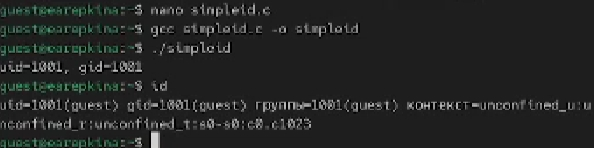
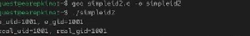
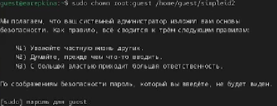
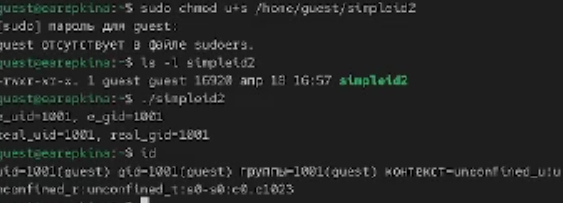
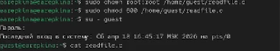
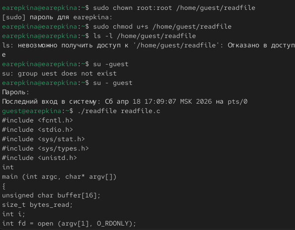
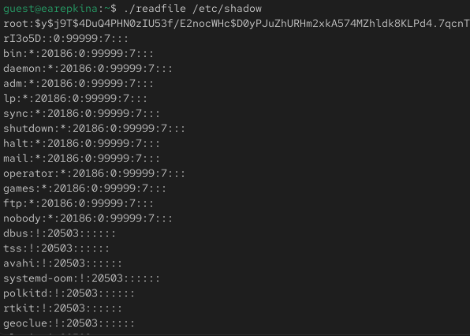
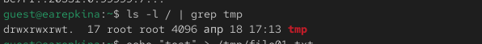
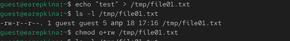
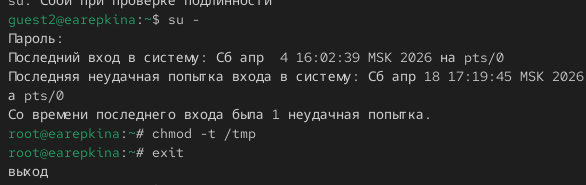

---
## Author
author:
  name: Репкина Елизавета Андреевна
  email: 1132246753@rudn.ru
  affiliation:
    - name: Российский университет дружбы народов
      country: Российская Федерация
      postal-code: 117198
      city: Москва
      address: ул. Миклухо-Маклая, д. 6

## Title
title: "Лабораторная работа №5"
---

# Информация

## Докладчик

:::::::::::::: {.columns align=center}
::: {.column width="70%"}

  * Репкина Елизавета Андреевна
  * Российский университет дружбы народов им. П. Лумумбы

:::
::: {.column width="30%"}

:::
::::::::::::::

# Ход работы
## От имени пользователя guest  выполнена компиляция и запуск программы simpleid, а также команда id ([рис. @fig-001]).

{#fig-001 width=70%}

## От имени пользователя guest  выполнена компиляция и запуск программы simpleid2 ([рис. @fig-002]).

{#fig-002 width=70%}

## От имени суперпользователя установлен владелец root и simpleid2, программа запущена ([рис. @fig-003]).

{#fig-003 width=70%}

## Для simpleid2 установлен setgit бит и выполнен запуск ([рис. @fig-004]).

{#fig-004 width=70%}

## Измнены права доступа к файлу readgile.c ([рис. @fig-005]).

{#fig-005 width=70%}

## Программа readfile скомпилирована, установлен setuid, выполнен запуск ([рис. @fig-006]).

{#fig-006 width=70%}

## Выполнена попытка чтения файла /etc/shadow ([рис. @fig-007]).

{#fig-007 width=70%}

## Проверены атрибуты директории /tmp ([рис. @fig-008]).

{#fig-008 width=70%}

## От другого пользователя выполнена попытка удаления файла в tmp([рис. @fig-009]).

{#fig-009 width=70%}

## Снят sticky бит с директории tmp([рис. @fig-010]).

{#fig-010 width=70%}

# Выводы

В результате выпонения лабораторной работы я изучила механизмы изменения идентификаторов, применения SetUID- и Sticky-битов. Получила практические навыки работы в консоли с дополнительными атрибутами. Рассмотрела работы механизма смены идентификатора процессов пользователей, а также влияние бита Sticky на запись и удаление файлов.
 

:::
