---
## Author
author:
  name: Репкина Елизавета Андреевна
  email: 1132246753@rudn.ru
  affiliation:
    - name: Российский университет дружбы народов
      country: Российская Федерация
      postal-code: 117198
      city: Москва
      address: ул. Миклухо-Маклая, д. 6

## Title
title: "Лабораторная работа №6"
---

# Информация

## Докладчик

:::::::::::::: {.columns align=center}
::: {.column width="70%"}

  * Репкина Елизавета Андреевна
  * Российский университет дружбы народов им. П. Лумумбы

:::
::: {.column width="30%"}

:::
::::::::::::::

## Цели и задачи

Развить навыки администрирования ОС Linux. Получить первое практическое знакомство с технологией SELinux1. Проверить работу SELinx на практике совместно с веб-сервером Apache.

# Ход работы

## 1

Вхожу в систему с полученными учётными данными и убеждаюсь, что SELinux работает в режиме enforcing политики targeted с помощью команд getenforce и sestatus.([рис. @fig-001])

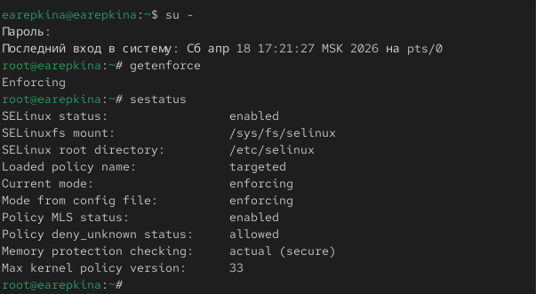{#fig-001 width=70%}

## 2

Выполняю команду service httpd status ([рис. @fig-002])

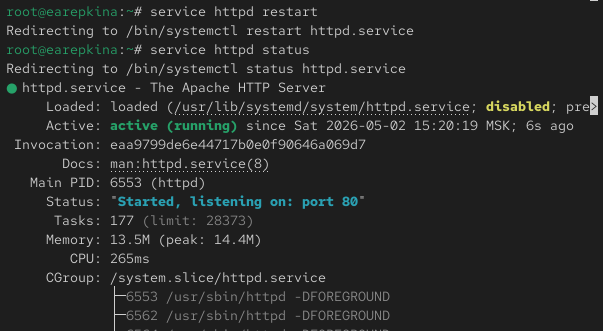{#fig-002 width=70%}

## 3

Нахожу веб-сервер Apache в списке процессов, определяю его контекст безопасности .([рис. @fig-003])

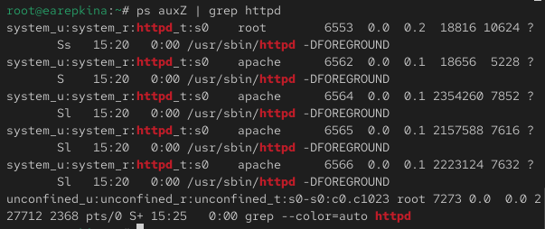{#fig-003 width=70%}

## 4

Смотрю статистику по политике с помощью команды seinfo, также определяю множество пользователей, ролей, типов.([рис. @fig-004])

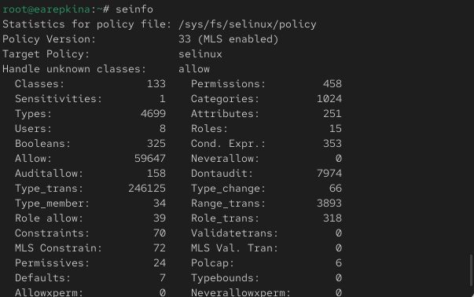{#fig-004 width=70%}

## 5

Определяю типы файлов и поддиректорий ([рис. @fig-005])

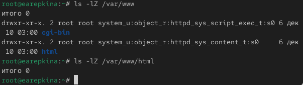{#fig-005 width=70%}

## 6

Создаю от имени суперпользователя (так как в дистрибутиве после установки только ему разрешена запись в директорию) html-файл /var/www/html/test.html следующего содержания:([рис. @fig-006])

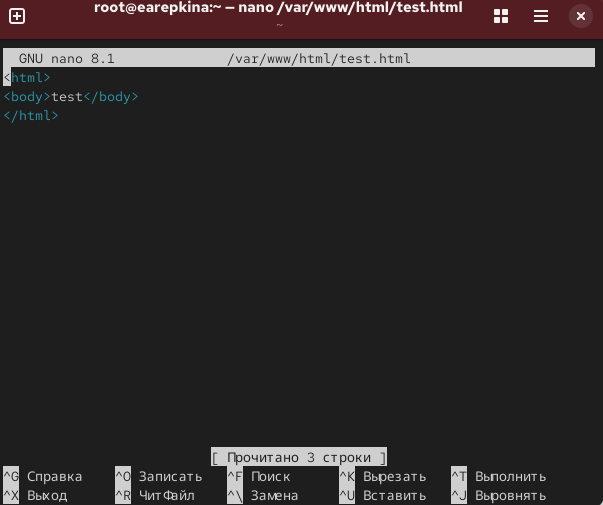{#fig-006 width=70%}

## 7

Обращаюсь к файлу через веб-сервер, введя в браузере адрес http://127.0.0.1/test.html. Убеждаюсь, что файл был успешно отображён.([рис. @fig-007])

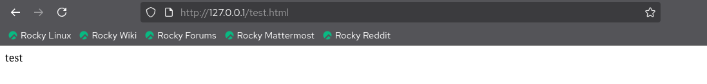{#fig-007 width=70%}

## 8

Изучаю справку man httpd_selinux и выясняю, какие контексты файлов определены для httpd. Сопоставляю их с типом файла test.html.([рис. @fig-008])

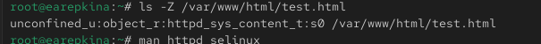{#fig-008 width=70%}

## 9

Измените контекст файла /var/www/html/test.html с httpd_sys_content_t на любой другой, к которому процесс httpd не должен иметь доступа, например, на samba_share_t: ([рис. @fig-009])

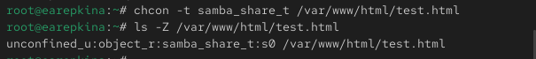{#fig-009 width=70%}

## 10

Пробую ещё раз получить доступ к файлу через веб-сервер, введя в браузере адрес http://127.0.0.1/test.html. Получаю  сообщение об ошибке([рис. @fig-010])

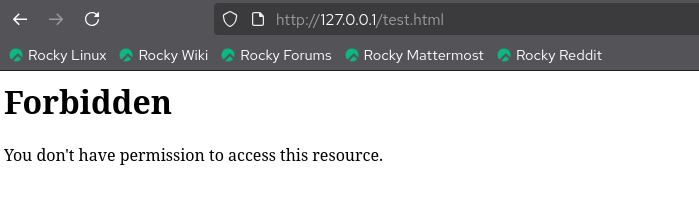{#fig-010 width=70%}

## 11

Анализирую ситуацию и просмотриваю log-файлы веб-сервера Apache. Также просматриваю системный лог-файл ([рис. @fig-011])

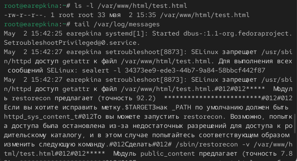{#fig-011 width=70%}

## 12

Запускаю веб-сервер Apache на прослушивание ТСР-порта 81 (а не 80, как рекомендует IANA и прописано в /etc/services)([рис. @fig-012])

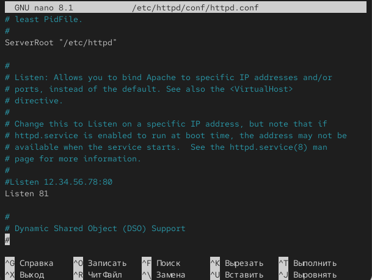{#fig-012 width=70%}

## 13

перезапускаю и просматриваю файлы([рис. @fig-013])

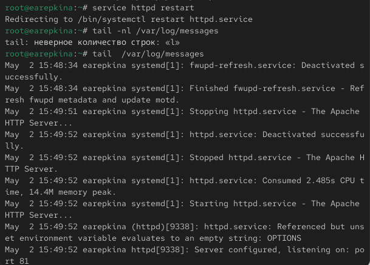{#fig-013 width=70%}

## 14

Выполняю команды ([рис. @fig-014])

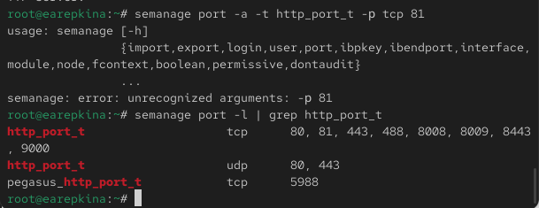{#fig-014 width=70%}

## 15

Возвращаю контекст httpd_sys_cоntent__t к файлу /var/www/html/ test.html: chcon -t httpd_sys_content_t /var/www/html/test.html После этого пробую получить доступ к файлу через веб-сервер, введя в браузере адрес http://127.0.0.1:81/test.html. содержимое файла — слово «test»([рис. @fig-015])

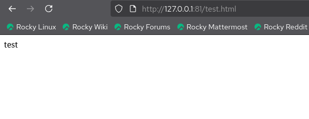{#fig-015 width=70%}

## 16

Исправляю обратно конфигурационный файл apache, вернув Listen 80 и удаляю файл([рис. @fig-016])

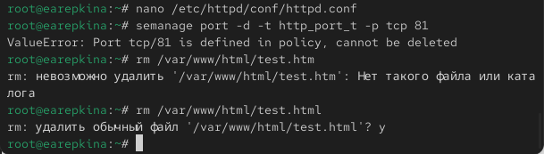{#fig-016 width=70%}

## Выводы

В ходе выполнения лабораторной работы я развила навыки администрирования ОС Linux. Получила первое практическое знакомство с технологией SELinux1. Проверила работу SELinx на практике совместно с веб-сервером Apache.

