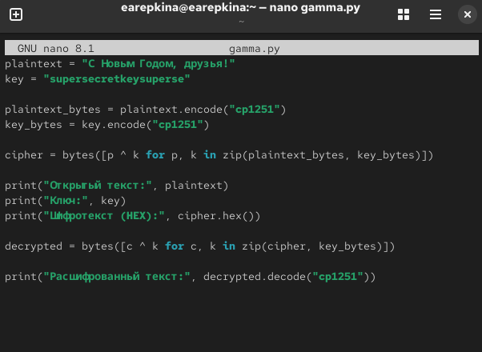
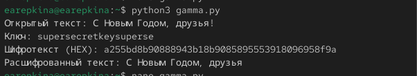

---
## Author
author:
  name: Репкина Елизавета Андреевна
  email: 1132246753@rudn.ru
  affiliation:
    - name: Российский университет дружбы народов
      country: Российская Федерация
      postal-code: 117198
      city: Москва
      address: ул. Миклухо-Маклая, д. 6

## Title
title: "Лабораторная работа №7"
---

# Информация

## Докладчик

:::::::::::::: {.columns align=center}
::: {.column width="70%"}

  * Репкина Елизавета Андреевна
  * Российский университет дружбы народов им. П. Лумумбы

:::
::: {.column width="30%"}

:::
::::::::::::::

## Цели и задачи

Освоить на практике применение режима однократного гаммирования

# Ход работы 

## 1 

Создаю python файл в тектовом редакторе нано, ввожу код шифрования методом гаммирования ([рис. @fig-001])

{#fig-001 width=70%}

## 2 

Сохраняю файл и запускаю программу ([рис. @fig-002])

{#fig-002 width=70%}

## 3 

Создаю новый файл ([рис. @fig-003])

{#fig-003 width=70%}

## 4

Запускаю программу ([рис. @fig-004])

{#fig-004 width=70%}

# Выводы

В результате выполнения лабороторной работы я осовила на практике применение режима однократного гаммирования

