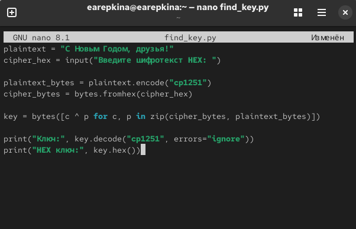

---
## Author
author:
  name: Репкина Елизавета Андреевна
  email: 1132246753@rudn.ru
  affiliation:
    - name: Российский университет дружбы народов
      country: Российская Федерация
      postal-code: 117198
      city: Москва
      address: ул. Миклухо-Маклая, д. 6

## Title
title: "Отчёт по лабораторной работе №7"
---

# Цель работы

Освоить на практике применение режима однократного гаммирования

# Задание

Нужно подобрать ключ, чтобы получить сообщение «С Новым Годом,
друзья!». Требуется разработать приложение, позволяющее шифровать и
дешифровать данные в режиме однократного гаммирования. Приложение
должно:
1. Определить вид шифротекста при известном ключе и известном откры-
том тексте.
2. Определить ключ, с помощью которого шифротекст может быть преоб-
разован в некоторый фрагмент текста, представляющий собой один из
возможных вариантов прочтения открытого текста.

# Выполнение лабораторной работы

Создаю python файл в тектовом редакторе нано, ввожу код шифрования методом гаммирования ([рис. @fig-001])

{#fig-001 width=70%}

Сохраняю файл и запускаю программу ([рис. @fig-002])

{#fig-002 width=70%}

Создаю новый файл ([рис. @fig-003])

{#fig-003 width=70%}

Запускаю программу ([рис. @fig-004])

{#fig-004 width=70%}
# Выводы

В результате выполнения лабороторной работы я осовила на практике применение режима однократного гаммирования

# Список литературы{.unnumbered}

::: {#refs}
:::
