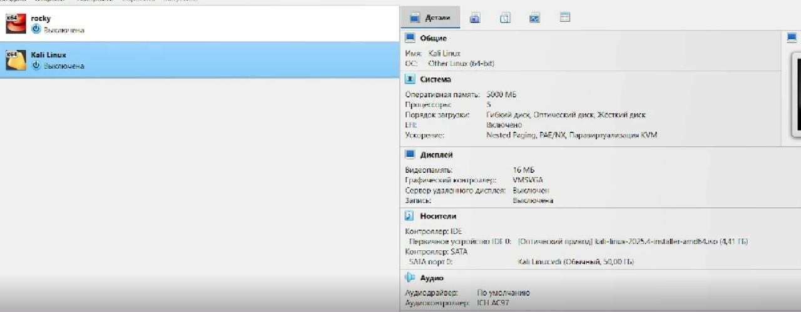
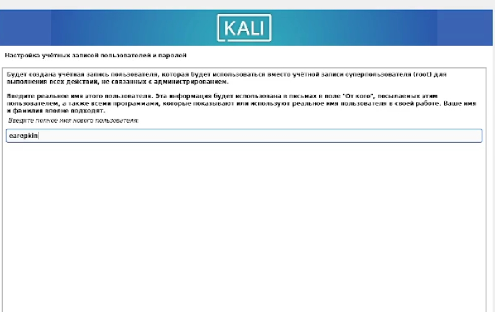
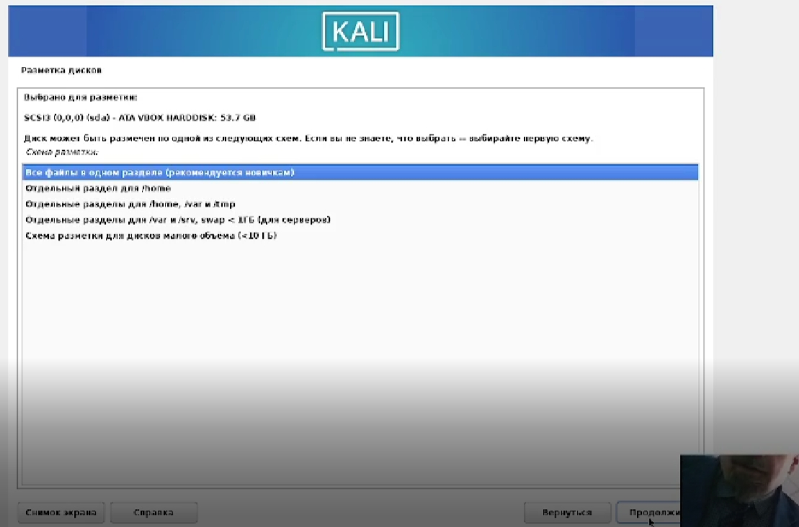
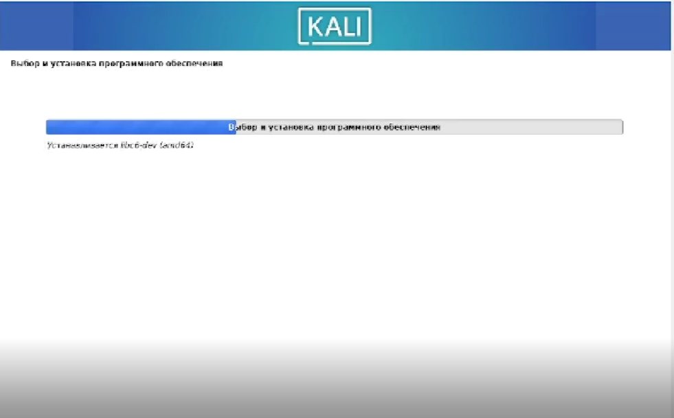

---
## Author
author:
  name: Репкина Елизавета Андреевна
  email: 1132246753@rudn.ru
  affiliation:
    - name: Российский университет дружбы народов
      country: Российская Федерация
      postal-code: 117198
      city: Москва
      address: ул. Миклухо-Маклая, д. 6

## Title
title: "Отчет о выполенинии Индивидуального проекта. Этап 1. Установка Kali Linux"
---

# Цель работы

Установка дистрибутива Kali Linux в виртуальную машину.

# Задание

1. Установка ОС
2. Настройка ОС

# Выполнение лабораторной работы

Скачиваю необходимое програмное ПО. Устанавливаю операционной системы Linux(дистрибутив Kali) ([рис. @fig-001]).

{#fig-001 width=70%}

Процесс задания имени пользователя и настройки учётной записи в ходе установки Kali Linux. Выполнена первичная конфигурация доступа к системе.([рис. @fig-002]).

{#fig-003 width=70%}

Продолжаю настраивать Kali Linux ([рис. @fig-003]).

{#fig-003 width=70%}

Производится загрузка и настройка системных модулей ([рис. @fig-004]).

{#fig-004 width=70%}

После завершения установки операционной системы корректно перезапускаю виртуальную машину ([рис. @fig-005]).

{#fig-005 width=70%}

# Выводы

Я преобрела практические навыки установки операционной системы на виртуальную машину, настройки минимально необходимых для дальнейшей работы сервисов.

# Список литературы{.unnumbered}

1. Парасрам, Ш. Kali Linux: Тестирование на проникновение и безопасность : Для профессионалов. Kali Linux / Ш. Парасрам, А. Замм, Т. Хериянто, и др. – Санкт-Петербург : Питер, 2022. – 448 сс.

::: {#refs}
:::
